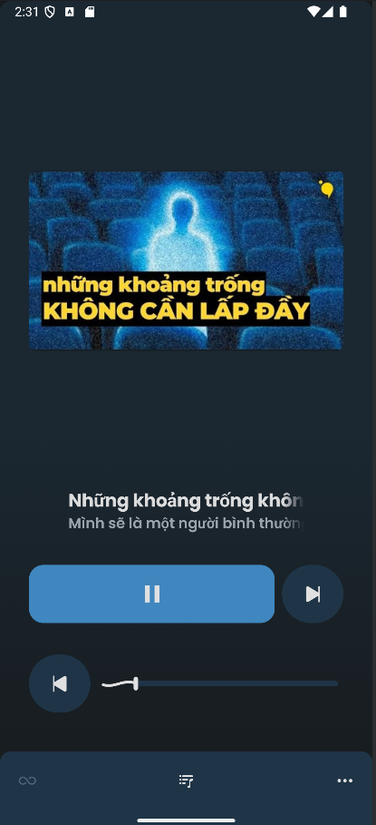
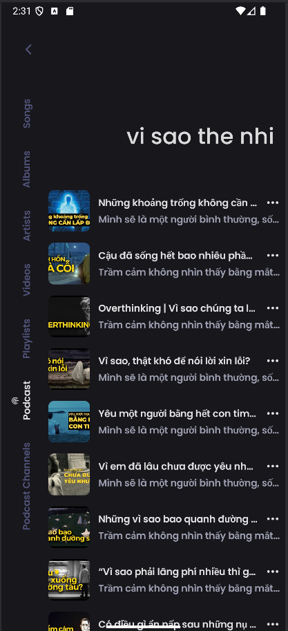
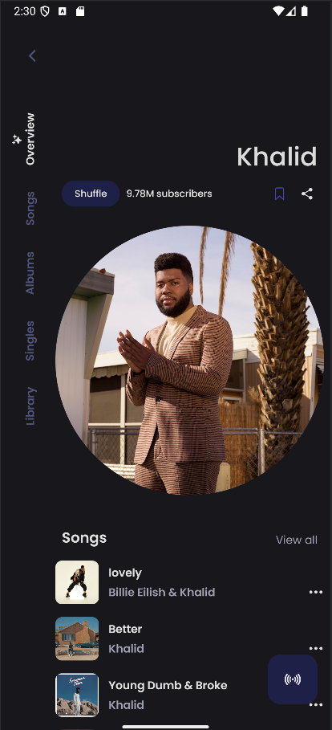
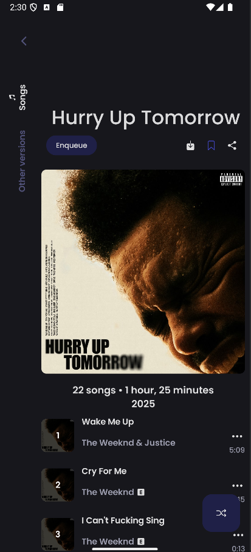

    
    <h1>ViTune</h1>
    
An Android application for seamless music streaming

---

  
  
  

  
  
  

## Features

# Podcast
Search, subscribe to podcasts via Innertube API
Play, seek, save position
Playback Menu: Play next, queue, download/delete, add/remove playlists, share, view on YouTube, add to favorites/blacklist
Download podcasts for offline use, cache storage
Create, edit playlists (CRUD)
View history, mark episodes as completed

# Music/Video
Play music/videos from YouTube Music or device
Background playback, offline caching
Search songs, albums, artists, videos, playlists
Discover music by mood/genre
Import YouTube playlists
Fetch, display, edit lyrics (synced)

# Account & Customization
Login/register with email/password
Update profile, reset password, logout
Manage playlists locally or sync to cloud
Customize UI (Material You, dynamic themes)
Normalize audio, support Android Auto
Open YouTube/YouTube Music links, lightweight APK
